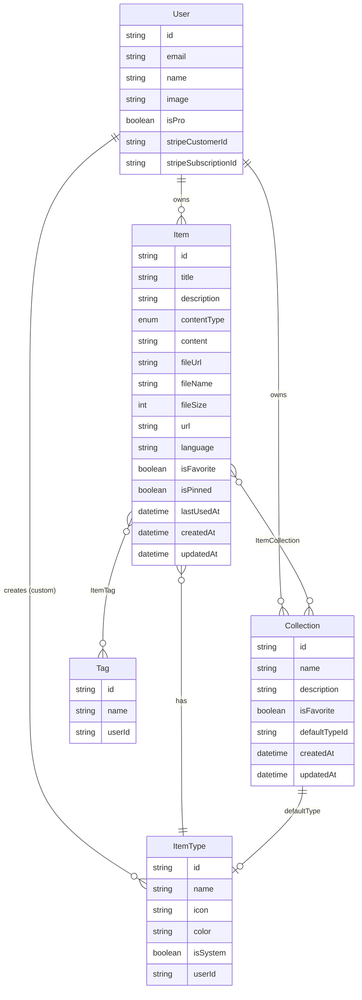
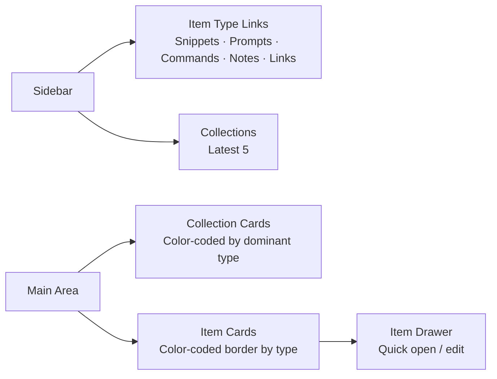

# DevStash — Project Overview

> A fast, searchable, AI-enhanced hub for all developer knowledge & resources.

---

## Problem

Developers keep their essentials scattered across too many places:

| What | Where |
|---|---|
| Code snippets | VS Code, Notion |
| AI prompts | Chat history |
| Context files | Buried in projects |
| Useful links | Browser bookmarks |
| Docs | Random folders |
| Commands | `.txt` files, bash history |
| Templates | GitHub Gists |

DevStash unifies all of this into one place — quick to access, easy to search, and AI-enhanced for pro users.

---

## Target Users

**Everyday Developer** — Grabs snippets, commands, and links fast.

**AI-first Developer** — Saves prompts, system messages, context files, and workflows.

**Content Creator / Educator** — Stores code blocks, explanations, and course notes.

**Full-stack Builder** — Collects patterns, boilerplates, and API examples.

---

## Tech Stack

| Layer | Choice |
|---|---|
| Framework | [Next.js](https://nextjs.org/) (App Router) + [React 19](https://react.dev/) |
| Language | TypeScript |
| Database | [Neon](https://neon.tech/) (PostgreSQL) |
| ORM | [Prisma 7](https://www.prisma.io/docs) |
| Auth | [NextAuth v5](https://authjs.dev/) — Email/password + GitHub OAuth |
| File Storage | [Cloudflare R2](https://developers.cloudflare.com/r2/) |
| AI | [OpenAI](https://platform.openai.com/docs) — `gpt-4o-mini` (or latest nano model) |
| Styling | [Tailwind CSS v4](https://tailwindcss.com/docs) + [shadcn/ui](https://ui.shadcn.com/) |
| Caching | Redis (TBD) |
| Payments | [Stripe](https://stripe.com/docs) |

> **DB migration rule:** Never use `db push` or direct schema edits. All schema changes go through Prisma migrations (`prisma migrate dev` → `prisma migrate deploy` in prod).

---

## Item Types

Each item has a type that controls display and routing. Types are either system-defined (locked) or user-created (pro, coming later).

| Icon | Type | Color | Hex | Content Kind | Route |
|---|---|---|---|---|---|
| `<Code />` | Snippet | Blue | `#3b82f6` | text | `/items/snippets` |
| `<Sparkles />` | Prompt | Purple | `#8b5cf6` | text | `/items/prompts` |
| `<Terminal />` | Command | Orange | `#f97316` | text | `/items/commands` |
| `<StickyNote />` | Note | Yellow | `#fde047` | text | `/items/notes` |
| `<Link />` | Link | Emerald | `#10b981` | url | `/items/links` |
| `<File />` | File | Gray | `#6b7280` | file | `/items/files` ⭐ Pro |
| `<Image />` | Image | Pink | `#ec4899` | file | `/items/images` ⭐ Pro |

> Icons reference [Lucide React](https://lucide.dev/icons/).

Content kinds: `text` | `url` | `file`

---

## Features

### Core

- **Items** — Create, view, edit, delete items of any type via a quick-access drawer
- **Collections** — Group items into named collections; items can belong to many collections
- **Search** — Full-text search across title, content, tags, and type
- **Tags** — Attach multiple tags to any item
- **Favorites** — Star collections and items
- **Pinned items** — Pin items to the top of lists
- **Recently used** — Surface recently accessed items
- **Markdown editor** — Rich editing for text-type items
- **File upload** — For `file` and `image` types (stored on Cloudflare R2)
- **Import** — Import code directly from a file
- **Export** — Export data as JSON or ZIP
- **Dark mode** — Default; light mode optional
- **Multi-collection** — Add/remove items to/from multiple collections; view an item's collection memberships

### AI Features (Pro only)

- Auto-tag suggestions
- Item summaries
- Explain This Code
- Prompt optimizer

---

## Data Model

### Entity Relationship Diagram



---

### Prisma Schema — Rough Draft

> ⚠️ This is a **rough draft**. Field names, types, and relations will evolve as development progresses.

```prisma
// schema.prisma
// Prisma 7 — https://www.prisma.io/docs

generator client {
  provider = "prisma-client-js"
}

datasource db {
  provider = "postgresql"
  url      = env("DATABASE_URL")
}

// ─── Enums ───────────────────────────────────────────────

enum ContentType {
  TEXT
  FILE
  URL
}

enum PlanTier {
  FREE
  PRO
}

// ─── User ────────────────────────────────────────────────
// Extends NextAuth default User model

model User {
  id                   String    @id @default(cuid())
  name                 String?
  email                String    @unique
  emailVerified        DateTime?
  image                String?
  password             String?   // hashed; null for OAuth users

  // Plan
  isPro                Boolean   @default(false)
  stripeCustomerId     String?   @unique
  stripeSubscriptionId String?   @unique

  // Relations
  accounts             Account[]
  sessions             Session[]
  items                Item[]
  collections          Collection[]
  itemTypes            ItemType[]
  tags                 Tag[]

  createdAt            DateTime  @default(now())
  updatedAt            DateTime  @updatedAt
}

// ─── NextAuth Tables ──────────────────────────────────────

model Account {
  id                String  @id @default(cuid())
  userId            String
  type              String
  provider          String
  providerAccountId String
  refresh_token     String?
  access_token      String?
  expires_at        Int?
  token_type        String?
  scope             String?
  id_token          String?
  session_state     String?

  user User @relation(fields: [userId], references: [id], onDelete: Cascade)

  @@unique([provider, providerAccountId])
}

model Session {
  id           String   @id @default(cuid())
  sessionToken String   @unique
  userId       String
  expires      DateTime

  user User @relation(fields: [userId], references: [id], onDelete: Cascade)
}

model VerificationToken {
  identifier String
  token      String   @unique
  expires    DateTime

  @@unique([identifier, token])
}

// ─── ItemType ─────────────────────────────────────────────

model ItemType {
  id       String  @id @default(cuid())
  name     String
  icon     String  // Lucide icon name, e.g. "Code", "Sparkles"
  color    String  // Hex color, e.g. "#3b82f6"
  isSystem Boolean @default(false)

  // null for system types
  userId   String?
  user     User?   @relation(fields: [userId], references: [id], onDelete: Cascade)

  items               Item[]
  defaultForCollections Collection[]

  @@unique([name, userId]) // system types are unique by name; user types unique per user
}

// ─── Item ─────────────────────────────────────────────────

model Item {
  id          String      @id @default(cuid())
  title       String
  description String?

  contentType ContentType
  content     String?     // text content (TEXT types)
  fileUrl     String?     // Cloudflare R2 URL (FILE types)
  fileName    String?     // original filename
  fileSize    Int?        // bytes
  url         String?     // for URL types
  language    String?     // e.g. "typescript", "python" (optional, for code snippets)

  isFavorite  Boolean     @default(false)
  isPinned    Boolean     @default(false)
  lastUsedAt  DateTime?

  userId      String
  user        User        @relation(fields: [userId], references: [id], onDelete: Cascade)

  typeId      String
  type        ItemType    @relation(fields: [typeId], references: [id])

  collections ItemCollection[]
  tags        ItemTag[]

  createdAt   DateTime    @default(now())
  updatedAt   DateTime    @updatedAt
}

// ─── Collection ───────────────────────────────────────────

model Collection {
  id            String   @id @default(cuid())
  name          String
  description   String?
  isFavorite    Boolean  @default(false)

  // Optional: default type for new items added to this collection
  defaultTypeId String?
  defaultType   ItemType? @relation(fields: [defaultTypeId], references: [id])

  userId        String
  user          User     @relation(fields: [userId], references: [id], onDelete: Cascade)

  items         ItemCollection[]

  createdAt     DateTime @default(now())
  updatedAt     DateTime @updatedAt
}

// ─── ItemCollection (join table) ──────────────────────────

model ItemCollection {
  itemId       String
  collectionId String
  addedAt      DateTime @default(now())

  item         Item       @relation(fields: [itemId], references: [id], onDelete: Cascade)
  collection   Collection @relation(fields: [collectionId], references: [id], onDelete: Cascade)

  @@id([itemId, collectionId])
}

// ─── Tag ──────────────────────────────────────────────────

model Tag {
  id     String    @id @default(cuid())
  name   String

  userId String
  user   User      @relation(fields: [userId], references: [id], onDelete: Cascade)

  items  ItemTag[]

  @@unique([name, userId])
}

// ─── ItemTag (join table) ─────────────────────────────────

model ItemTag {
  itemId String
  tagId  String

  item   Item @relation(fields: [itemId], references: [id], onDelete: Cascade)
  tag    Tag  @relation(fields: [tagId], references: [id], onDelete: Cascade)

  @@id([itemId, tagId])
}
```

---

## Monetization

### Freemium Model

| Feature | Free | Pro ($8/mo · $72/yr) |
|---|---|---|
| Items | 50 total | Unlimited |
| Collections | 3 | Unlimited |
| System types | All except File & Image | All |
| File & Image uploads | ❌ | ✅ |
| Custom types | ❌ | ✅ (coming later) |
| AI features | ❌ | ✅ |
| Export (JSON/ZIP) | ❌ | ✅ |
| Priority support | ❌ | ✅ |

> **Dev note:** All features are unlocked for all users during development. The pro gate is wired up but not enforced until launch.

Payments via [Stripe](https://stripe.com/docs/billing). Key IDs (`stripeCustomerId`, `stripeSubscriptionId`) stored on the `User` model.

---

## UI / UX

### Layout



**Sidebar** — Collapsible. Contains item-type nav links and latest collections. Becomes a drawer on mobile.

**Main** — Collection cards with background tinted by their most-common item type. Item cards show a colored left border matching their type.

**Drawer** — Individual items open in a slide-in drawer for fast access and editing without leaving context.

### Design References

- [Notion](https://notion.so) — Clean information hierarchy
- [Linear](https://linear.app) — Developer-grade UI density
- [Raycast](https://raycast.com) — Speed-first interaction model

### Screenshots
- Refer to the screenshots below as a base for the dashboard UI. It does not have to be exact. Use it as a reference:
- @context/screenshots/dashboard-ui-main.png
- @context/screenshots/dashboard-ui-popup.png

### Interaction Details

- Smooth transitions on all state changes
- Hover states on cards
- Toast notifications for CRUD actions
- Loading skeletons for async data
- Syntax highlighting in code blocks (e.g. [Shiki](https://shiki.style/) or [highlight.js](https://highlightjs.org/))
- Markdown editor for text types (e.g. [Tiptap](https://tiptap.dev/) or [Milkdown](https://milkdown.dev/))

---

## Key Links

| Resource | URL |
|---|---|
| Next.js Docs | https://nextjs.org/docs |
| React 19 | https://react.dev |
| Prisma Docs | https://www.prisma.io/docs |
| Neon | https://neon.tech/docs |
| NextAuth v5 | https://authjs.dev/getting-started |
| Cloudflare R2 | https://developers.cloudflare.com/r2/ |
| OpenAI API | https://platform.openai.com/docs |
| Tailwind v4 | https://tailwindcss.com/docs |
| shadcn/ui | https://ui.shadcn.com/ |
| Lucide Icons | https://lucide.dev/icons/ |
| Stripe Billing | https://stripe.com/docs/billing |
| Shiki (syntax) | https://shiki.style/ |

---

*Last updated: 2026-05-28*
